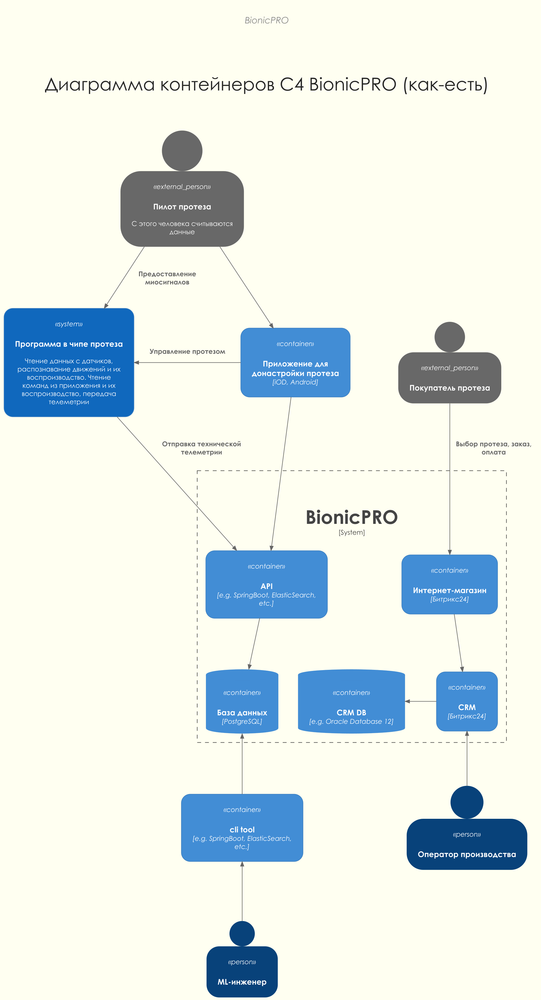
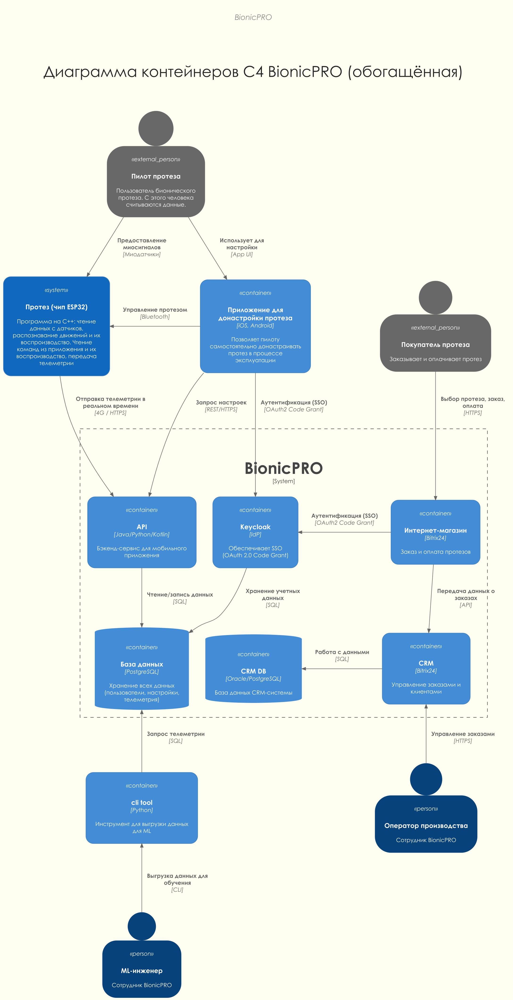
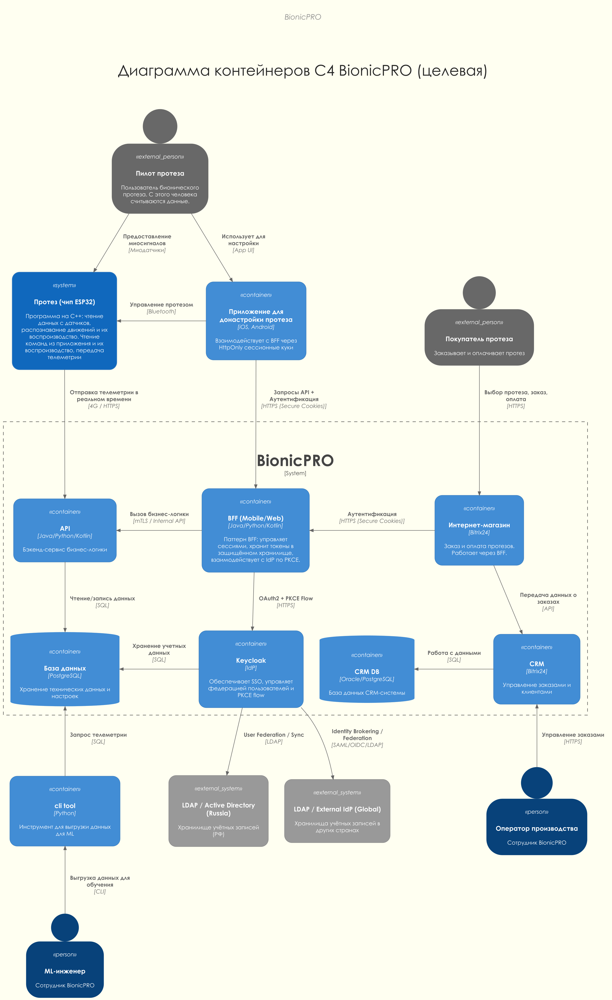

# Задание 1. Повышение безопасности системы

## Задача 1. Архитектурное решение и доработка диаграммы C4 для управления учётными данными пользователя.

### Перенесём диаграмму as-is в формат PlantUML:

Для компактности диаграмма развёрнута в вертикальную.

Все надписи и опечатки сохранены.



### Обогатим диаграмму информацией из задания

Что было изменено:

- **Добавлен Keycloak:** в изначальной схеме отсутствовал важный компонент SSO, через который осуществляется аутентификация в магазине и мобильном приложении по протоколу OAuth2 Code Grant.
- **Уточнены технологии:** заменены заглушки `e.g. SpringBoot...` на конкретные технологии из описания (C++ для чипа ESP32, 4G модуль для передачи данных).
- **Исправлены связи телеметрии:** согласно заданию, данные с протеза теперь поступают в режиме реального времени.
- **Логическая группировка:** компоненты BionicPRO объединены в общую границу системы.
- **Исправлены опечатки:** например, `iOD` исправлен на `iOS`.



### Архитектурная доработка



#### Как решение учитывает аспекты из задания

#### 1. Унификация доступа и локальное хранение
Для решения этой задачи в Keycloak настроен механизм **User Federation** и **Identity Brokering**. 
- **Локальность данных:** Keycloak подключается к внешним LDAP/AD серверам в странах представительства. Персональные данные хранятся в исходных странах, а Keycloak лишь синхронизирует необходимые атрибуты для сессии или федеративно делегирует аутентификацию.
- **Масштабируемость:** Добавление новой страны требует лишь настройки нового Identity Provider или LDAP-коннектора в Keycloak.

#### 2. Безопасная схема работы с токенами (BFF)
Внедрён паттерн **BFF (Backend for Frontend)**:
- **Исключение токенов на клиенте:** Мобильное приложение и веб-фронтенд больше не получают Access и Refresh токены напрямую. Обмен кода на токены происходит на стороне BFF (сервис в директории `backend/`).
- **HttpOnly Cookies:** Фронтенд взаимодействует с BFF через защищённые сессионные куки (`HttpOnly`, `Secure`, `SameSite=Strict`). Токены хранятся в зашифрованном виде внутри сессии на бэкенде, что исключает их кражу через XSS.
- **Confidential Client:** Клиент в Keycloak переведен в режим `confidential`, секрет хранится только на стороне BFF.

#### 3. Безопасный обмен кодов (PKCE)
Механизм **PKCE** теперь полностью реализован на стороне BFF:
1. При вызове `/auth/login` бэкенд генерирует `code_verifier` и `code_challenge`.
2. `code_verifier` временно сохраняется в защищенной куке.
3. При возврате пользователя на `/auth/callback` бэкенд использует сохраненный верификатор для обмена кода на токен.

### Реализация LDAP User Federation
В конфигурацию Keycloak (`realm-export.json`) добавлен провайдер `ldap-provider`, который синхронизирует пользователей из внешнего LDAP-сервера (развернут в docker-compose). Это позволяет унифицировать доступ для пользователей из разных стран, сохраняя данные локально.

## Задача 2. Улучшите безопасность существующего приложения, заменив Code Grant на PKCE.

Для повышения безопасности процесса авторизации и защиты от атак перехвата кода (Authorization Code Interception Attack), в систему был внедрён механизм **PKCE (Proof Key for Code Exchange)**. Согласно паттерну BFF, реализация PKCE перенесена с клиентской части на сторону Бэкенда.

### Проделанные изменения:

#### 1. Настройка Keycloak

В файле `keycloak/realm-export.json` для клиента `reports-frontend` было добавлено требование использования PKCE:
- Установлен атрибут `pkce.code.challenge.method` со значением `S256`. Это заставляет Keycloak требовать наличие `code_challenge` при запросе кода и `code_verifier` при его обмене на токен.
- Клиент переведен в режим `confidential` (требуется client secret), что делает невозможным обмен кода без участия BFF-сервиса.

#### 2. Доработка Фронтенда

Фронтенд был полностью переработан для работы в режиме **"Tokenless SPA"**:
- Из приложения полностью удалена библиотека `keycloak-js` и любые механизмы хранения токенов в `localStorage`.
- Аутентификация теперь проверяется через запрос к BFF (`/auth/me`), который возвращает статус сессии на основании `HttpOnly` куки.
- Логика Login/Logout теперь осуществляется через редиректы на соответствующие эндпоинты BFF.

### Пояснение механизма PKCE и безопасности в BFF

Паттерн BFF позволил реализовать PKCE и защиту сессии максимально надежно:

1. **Генерация (BFF `/auth/login`):** При инициации входа Бэкенд генерирует случайный `code_verifier`, его хэш `code_challenge`, а также случайный параметр `state`. 
2. **Временное хранение:** `code_verifier` и `state` сохраняются в браузере пользователя в виде временной `HttpOnly` куки `pkce_data`. Это гарантирует защиту от кражи верификатора через XSS и защиту от CSRF-атак на этапе авторизации.
3. **Авторизация (Keycloak):** Пользователь перенаправляется в Keycloak. В URL передается `code_challenge`, `code_challenge_method=S256` и `state`.
4. **Обмен (BFF `/auth/callback`):** После успешного входа Keycloak возвращает пользователя с `code` и `state`. BFF проверяет совпадение `state` из URL и из куки, затем считывает `code_verifier` и отправляет его вместе с `code` и `client_secret` для получения токенов.
5. **Token Refresh:** BFF автоматически обновляет `access_token`, используя `refresh_token`, если основной токен истек. Это происходит прозрачно для фронтенда в эндпоинте `/auth/me`.
6. **CSRF Protection:** Помимо `SameSite=Strict` для кук, BFF проверяет заголовок `Origin` для всех мутирующих запросов, предотвращая запросы со сторонних ресурсов.
7. **RP-Initiated Logout:** При выходе BFF не только удаляет куку, но и уведомляет Keycloak о завершении сессии (через `id_token_hint`), что гарантирует полное закрытие SSO-сессии.
8. **Data Sanitization:** BFF фильтрует Claims от Keycloak, отдавая фронтенду только необходимые поля, что исключает утечку лишней информации из токенов.

### Тест

Для проверки работы стека написан простой тест [test.sh](test.sh)

Перед запуском теста нужно **из корня репозитория** перезапустить стек:

```
docker compose down -v
docker compose up -d --build
```

### Пример запуска теста

```
$ task1/test.sh                                                                                                                                               
                                                                                                                                                              
>>> Service Connectivity                                                                                                                                      
[ OK ] Frontend responds to HTTP : <title>Reports App</title>                                                                                                 
[ OK ] Backend /reports returns 401 for anonymous : 401 Unauthorized                                                                                          
[ OK ] Backend /auth/me returns {authenticated:false} : {"authenticated":false}                                                                               
                                                                                                                                                              
>>> BFF & PKCE Deep Verification                                                                                                                              
[ OK ] BFF /auth/login sets pkce_data : set-cookie: pkce_data=eyJ2ZXJpZmllciI6InZYMHNCcG41TjJxZ1RVN1lFVDdSaURpb08wQlZJdnE0Y1ZtNHQ0OGlzUllhbGRiM1lXbHRzVDdXSm82
aWhaWHZWcmtudWpQcUpXcjBpVWVKUFJKbmJRIiwic3RhdGUiOiJvWS1JREk1dnRsbWxuSEtpSVFrYW5tRkxPU09QUFl4VnBuZy03T0R4aGM4In0.91uIlsT0EtLtWPEat5GNHsW93V0; HttpOnly; Path=/;
 SameSite=Strict                                                                                                                                              
[ OK ] BFF /auth/login uses HttpOnly : HttpOnly                                                                                                               
[ OK ] PKCE Challenge in redirect URL : code_challenge=HD4-Puhr-KamPdXwGvcP6Cn9cfud3nLWzkGe25JO2VE                                                            
[ OK ] PKCE State in redirect URL : state=C8Whc4s4A5O_h6QsIsRolCaqe7xg1m9pTdUDBbCIl3Q                                                                         
[ OK ] PKCE Protection: Callback fails without cookie : 400 Bad Request (Protected)                                                                           
                                                                                                                                                              
>>> Security Headers & Hardening                                                                                                                              
[ OK ] X-Frame-Options: DENY : x-frame-options: DENY                                                                                                          
[ OK ] X-Content-Type-Options: nosniff : x-content-type-options: nosniff                                                                                      
                                                                                                                                                              
>>> Token Isolation Check                                                                                                                                     
[ OK ] Frontend: no keycloak-js library usage : Frontend is clean                                                                                             
[ OK ] Frontend: no localStorage for tokens : No tokens in client storage                                                                                     
[ OK ] Backend: tokens NOT leaked in body : No tokens in JSON body                                                                                            
                                                                                                                                                              
>>> Identity & LDAP Integration                                                                                                                               
[ OK ] LDAP: Entry john.doe exists : User Found                                                                                                               
[ OK ] LDAP: Group prosthetic_user exists : Group Found                                                                                                       
[ OK ] Keycloak logs: configuration loaded : Config Loaded                                                                                                    
[ OK ] Keycloak logs: Realm reports-realm ready : Realm Ready                                                                                                 
                                                                                                                                                              
>>> End-to-End Authentication Test                                                                                                                            
[ OK ] Auth: Login with Keycloak user (user1) : Login Success                                                                                                 
[ OK ] Auth: Login with LDAP user (john.doe) : LDAP Login Success                                                                                             
                                                                                                                                                              
>>> BFF Session & Token Handling                                                                                                                              
[ OK ] BFF correctly identifies user from session cookie : BFF Session Validated                                                                              
                                                                                                                                                              
>>> Frontend to BFF Integration                                                                                                                               
[ OK ] BFF allows requests from Frontend Origin (CORS) : CORS Allowed                                                                                         
[ OK ] BFF allows credentials (cookies) from Frontend : Credentials Allowed                                                                                   
```
